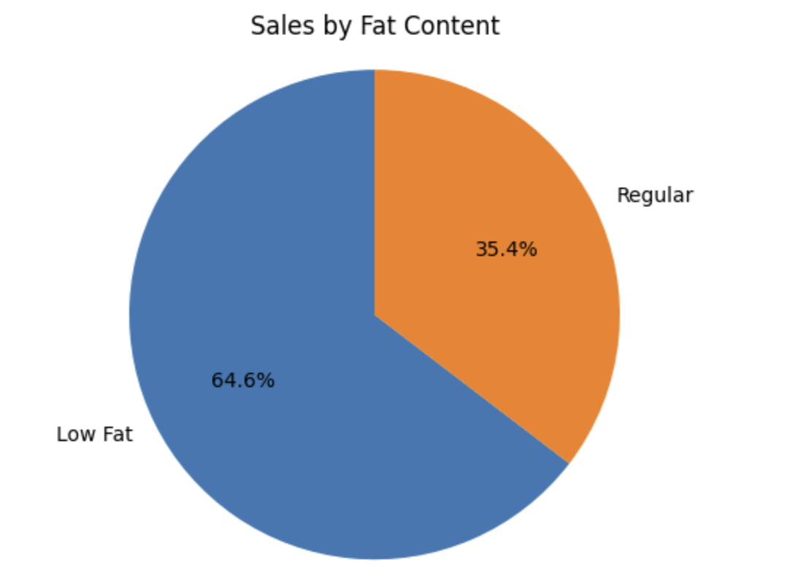
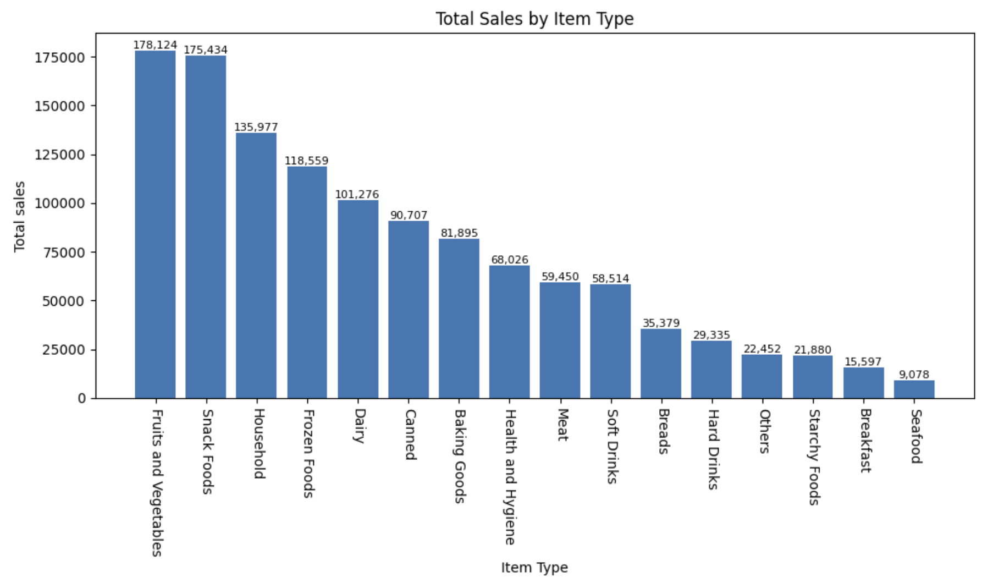
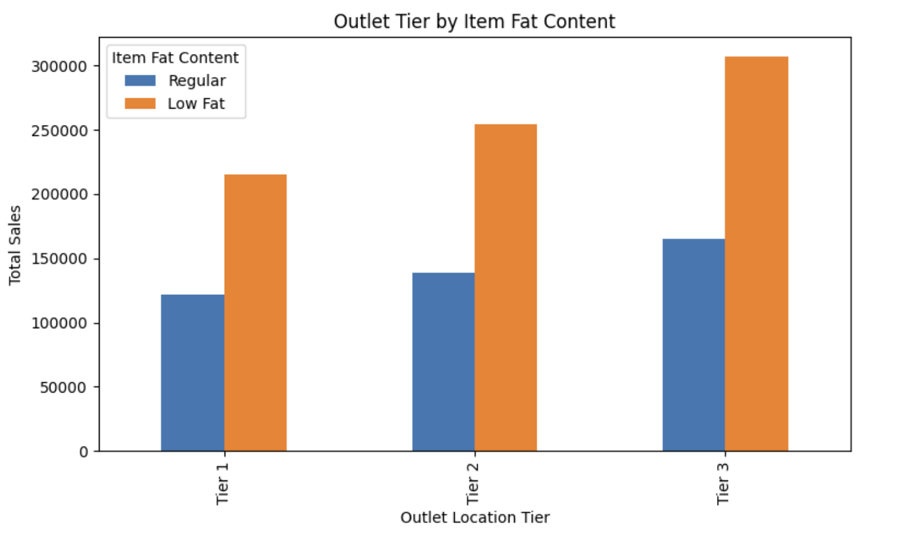
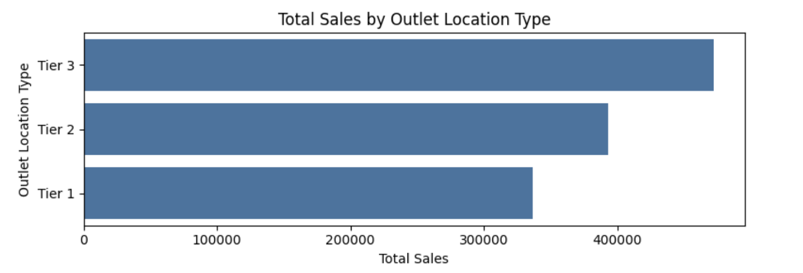

# Blinkit-Data-Analysis

This project involved performing an in-depth analysis of Blinkit’s sales dataset to evaluate product performance, outlet characteristics, and customer purchasing behavior. The workflow included comprehensive data cleaning, exploratory data analysis (EDA), KPI computation, and development of visual insights to support data-driven business decision-making.  

## ***KPI Metrics***
1. Total Sales: The overall revenue generated from all items sold.
2. Average Sales: The average revenue per sale.
3. Number of Items: The total count of different items sold.
4. Average Rating: The average customer rating for items sold.  

***Visualizations***

1] **Total Sales by Fat Content:**
- Objective: Analyze the impact of fat content on total sales.
- Additional KPI Metrics: Assess how other KPIs (Average Sales, Number of Items, Average Rating) vary with fat content.
- Chart Type: Donut Chart/ Pie Chart

 

~ Low-Fat items dominate sales (~65%), while Regular-Fat items contribute ~35%. 
~ Across all outlet tiers, Low-Fat products consistently outperform Regular-Fat items, indicating consumer preference for healthier options. 

✔ Business Implication: 
Increase inventory, visibility, and promotions for Low-Fat product lines.  

2] **Total Sales by Item Type:**
- Objective: Identify the performance of different item types in terms of total sales.
- Additional KPI Metrics: Assess how other KPIs (Average Sales, Number of Items, Average Rating) vary with fat content.
- Chart Type: Bar Chart

 

~ Top-selling categories: 
  - Fruits & Vegetables (~178K) 
  - Snack Foods (~175K) 
  - Household Items (~136K) 
  - Frozen Foods (~119K) 
  - Dairy (~101K) 

~ Lowest performers: 
Seafood, Breakfast, Starchy Foods 

✔ Business Implication: 
Maintain inventory priority for high-selling categories. 
Reassess pricing, placement, or demand for lower-selling items.  

3] **Fat Content by Outlet for Total Sales:**
- Objective: Compare total sales across different outlets segmented by fat content.
- Additional KPI Metrics: Assess how other KPIs (Average Sales, Number of Items, Average Rating) vary with fat content.
- Chart Type: Stacked Column Chart

 

~ In every location tier, Low-Fat items outperform Regular-Fat items. 
~ Tier-3 + Low-Fat = strongest revenue segment. 

✔ Business Implication: 
Target Tier-3 areas for expanding Low-Fat product lines.  

4] **Total Sales by Outlet Establishment:**
- Objective: Evaluate how the age or type of outlet establishment influences total sales.
- Chart Type: Line Chart

 

~ Outlets established earliest (around 1997) show highest sales (~205K). 
~ Newer outlets have relatively steady but lower sales (~130K). 
~ A sharp dip appears around 2011, but sales recover later. 

✔ Business Implication: 
Older outlets likely have strong brand trust and customer loyalty. 
Newer stores require promotion, awareness, and product variety strategies.  

5] **Sales by Outlet Size:**
- Objective: Analyze the correlation between outlet size and total sales.
- Chart Type: Donut/ Pie Chart

 

~ Medium-sized outlets drive the highest share of sales (~42.3%). 
~ Small outlets contribute ~37%, while Large outlets generate the least (~20.7%). 

✔ Business Implication: 
Medium outlets are the sweet spot—balance of inventory & customer reach. 
Large outlets may be under-optimized.  

6] **Sales by Outlet Location:**
- Objective: Assess the geographic distribution of sales across different locations.
- Chart Type: Bar Chart

 

~ Tier-3 outlets generate the highest total sales, followed by Tier-2 and Tier-1. 
~ This indicates greater customer demand and stronger market presence in Tier-3 regions, suggesting Blinkit has deeper penetration there. 

✔ Business Implication: 
Focus expansion, marketing, and supply-chain strengthening in Tier-3 areas.
